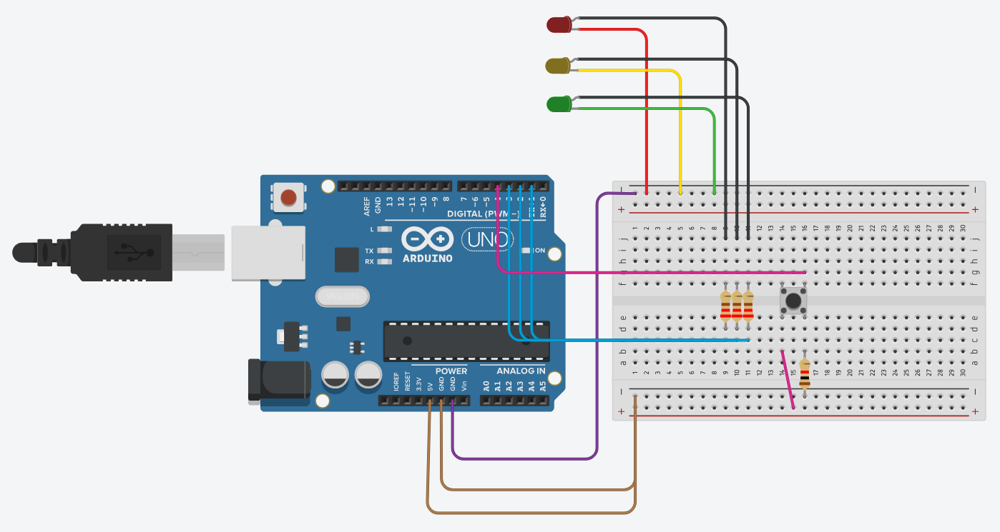
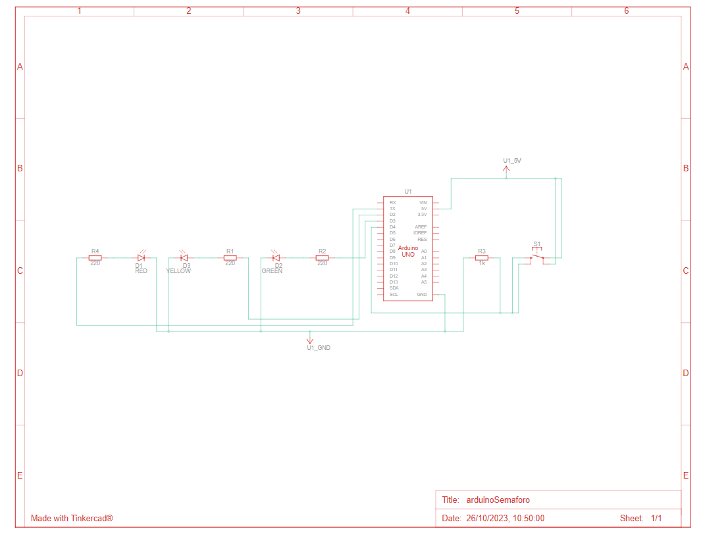

# arduinoSemaforo
um projeto de arduino com um semáforo que fica aberto toda hora e só fechar quando pedestre aperta o botão.
 

  <h3>Um semáforo feito no arduino pelo tinkercad para a atividade de sistemas embarcados na ETEC.</h3>
   

